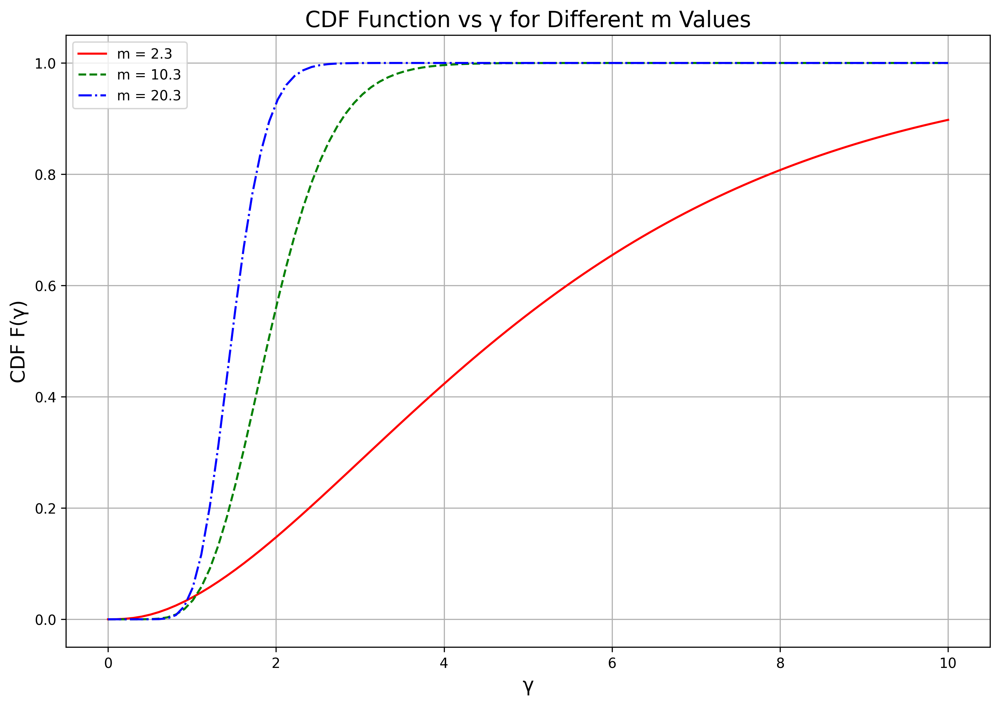
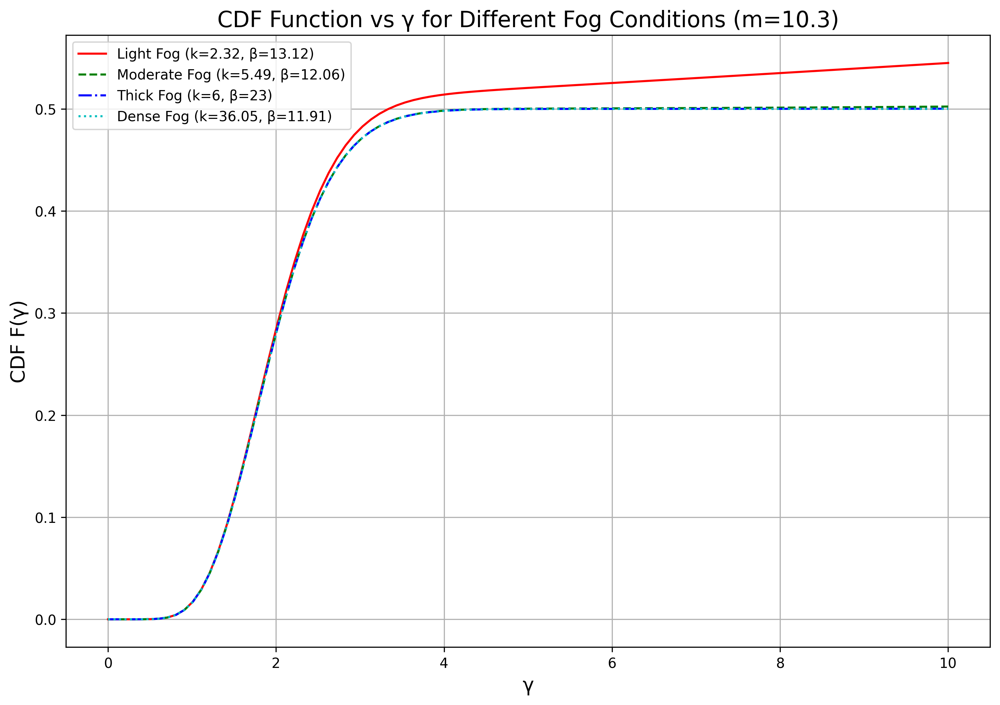
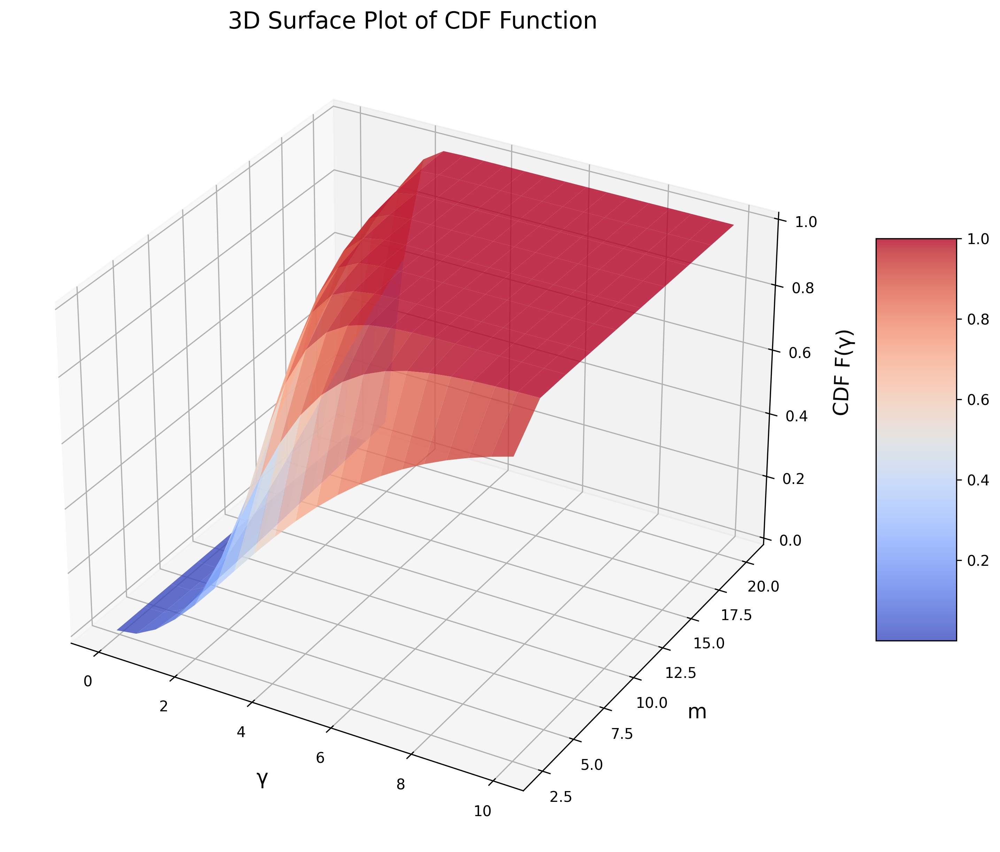
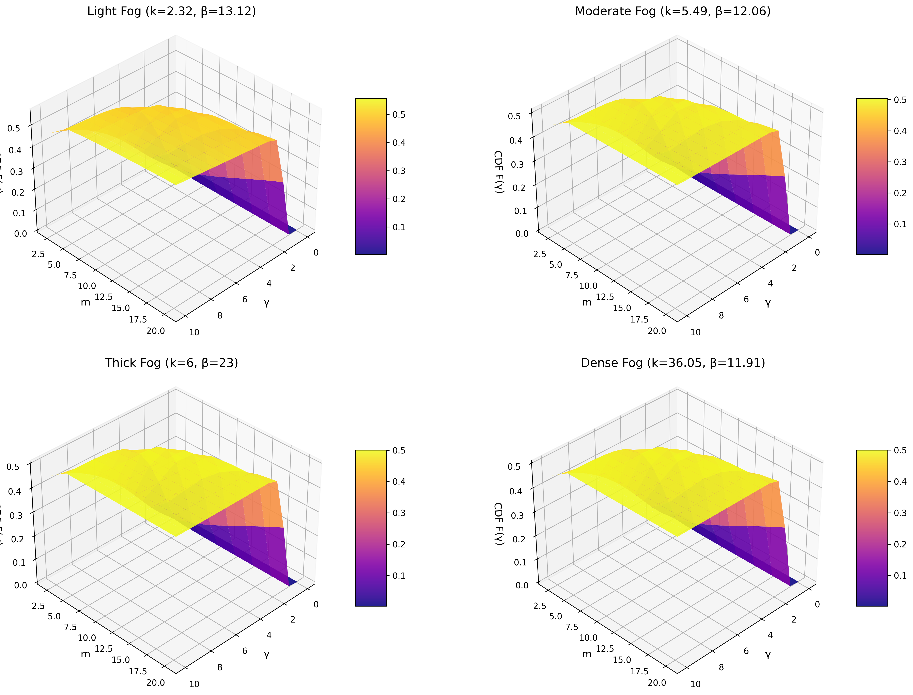

# Fog-Attenuated Wireless Communication CDF Analysis

This code implements and analyzes Cumulative Distribution Functions (CDFs) for fog-attenuated wireless communication channels using both exact Fox H-function calculations and simplified approximations. The program provides comprehensive visualizations of how various environmental and system parameters affect communication performance through fog.

## Overview

The program models how fog affects wireless communication signals by calculating the Cumulative Distribution Function (CDF) of the received signal-to-noise ratio (SNR) under different fog conditions and system parameters. This helps in understanding and predicting communication reliability in foggy environments.

## Mathematical Foundation

### Exact CDF Calculation

The exact CDF calculation is based on the Fox H-function, which is defined as:

```
I_{p,q}^{m,n} [ z | (a_1, α_1, A_1), ..., (a_p, α_p, A_p)
                  (b_1, β_1, B_1), ..., (b_q, β_q, B_q) ] 
= (2πi)^{-1} ∫_L φ(s) z^s ds
```

Where φ(s) is:

```
φ(s) = [∏_{j=1}^m Γ^{B_j}(b_j - β_j s) ∏_{j=1}^n Γ^{A_j}(1 - a_j + α_j s)] / 
       [∏_{j=m+1}^q Γ^{B_j}(1 - b_j + β_j s) ∏_{j=n+1}^p Γ^{A_j}(a_j - α_j s)]
```

The specific Fox H-function used in the CDF calculation is:

```
I_{3,1}^{3,4}[ z | (1-ρ²/2, 1, 1), (1+z-ρ², 2, k), (1, 1, 1)
                   (j-ρ²/2+1, 1, 1), (0, 1, 1), (z-ρ², 2, k), (-ρ²/2, 1, 1) ]
```

The exact CDF is calculated using:

```
F_Υ(γ) = (ρ² z^k m^m) / (2(2σ² A₀² h_l² γ̄)^(ρ²/2) Γ(m)) · γ^(ρ²/2) 
         · ∑_{j=0}^∞ (a_j K^j / (j!)²) · I_{3,1}^{3,4}[γ/(2σ² A₀² h_l² γ̄) | ...]
```

### Simplified Approximation

The simplified CDF approximation avoids the computationally intensive Fox H-function calculation, using instead:

1. A gamma distribution approximation using the incomplete gamma function
2. An adjustment factor based on fog parameters

```
CDF_simplified(γ) = Γ(m, 0, m·x, regularized=True) · (1 + adjustment) / 2
```

where:
- `x = γ · norm_factor / gamma_bar`
- `norm_factor = 1 / (1 + (K / m))`
- `adjustment = 1 - exp(-(ρ · z · x)^(k/2))`

## Key Parameters

The code analyzes how the CDF changes based on these key parameters:

### System Parameters

- `m_values`: Nakagami fading parameter (values tested: 2.3, 10.3, 20.3)
- `h_l`: Channel attenuation coefficient (0.49933)
- `A_0`: Amplitude of the signal (1)
- `gamma_bar`: Average SNR (1)
- `K`: Rician K-factor (10)
- `rho`: Shape parameter (3.38)
- `z`: Base propagation parameter (4.343)
- `d`: Transmission distance in meters (30)

### Fog Conditions

| Fog Type     | β (Extinction Coefficient) | k (Scattering Factor) |
|--------------|----------------------------|----------------------|
| Light Fog    | 13.12                      | 2.32                 |
| Moderate Fog | 12.06                      | 5.49                 |
| Thick Fog    | 23                         | 6                    |
| Dense Fog    | 11.91                      | 36.05                |

### Channel Variations

- `delta_values`: Channel variation factor (0.1, 0.5, 1)

## Implementation Features

### Computational Methods

1. **Fox H-function Calculation**:
   - Implements the Mellin-Barnes integral to compute the Fox H-function
   - Uses high-precision arithmetic with `mpmath` (50 digits precision)
   - Employs timeout mechanisms to prevent hanging calculations
   - Applies contour integration in the complex plane

2. **Performance Optimizations**:
   - GPU acceleration using CuPy when available
   - Parallel processing with Python's multiprocessing library
   - Fallback mechanisms for computational challenges
   - Error handling for numerical stability issues

### Visualizations Generated

The code generates multiple types of visualizations:

1. **2D Plots**:
   - CDF vs gamma for different m values
   - CDF vs gamma for different fog conditions
   - CDF vs gamma for different delta values

2. **3D Visualizations**:
   - 3D surface plots of CDF as a function of gamma and m
   - 3D visualization with fog type as color parameter
   - Multiple 3D surfaces for different fog conditions
   - 3D animations showing the surfaces from different angles

## Generated Output Files

### Simplified CDF Plots
- `cdf_m_comparison.png` - Shows how the CDF varies with different m values
- `cdf_fog_comparison.png` - Shows how the CDF varies with different fog conditions
- `cdf_delta_comparison.png` - Shows how the CDF varies with different delta values
- `cdf_3d_surface.png` - 3D surface plot of CDF as a function of gamma and m

### Exact CDF Plots
- `exact_cdf_m_comparison.png` - Exact CDF variation with different m values
- `exact_cdf_fog_comparison.png` - Exact CDF variation with different fog conditions
- `exact_cdf_delta_comparison.png` - Exact CDF variation with different delta values
- `exact_cdf_3d_surface.png` - 3D surface plot of exact CDF

### Advanced 3D Visualizations
- `cdf_3d_fog_delta_visualization.png` - 3D visualization with fog type as color parameter
- `cdf_multiple_3d_surfaces.png` - Multiple 3D surfaces for different fog conditions
- `cdf_3d_view_*.png` - 3D animations showing the surfaces from different angles

## Sample Results

Below are descriptions of what the generated images typically show:

### CDF Comparison for Different m Values

This plot shows how the CDF changes with different values of the Nakagami fading parameter m. Higher m values typically result in steeper CDF curves, indicating less fading variability.

### CDF Comparison for Different Fog Conditions

This plot illustrates how different fog conditions (light, moderate, thick, and dense) affect the CDF. Denser fog conditions generally result in worse performance (curves shifted to the left).

### 3D Surface Plot of CDF

This 3D surface provides a comprehensive view of how both gamma and m simultaneously affect the CDF values.

### Multiple 3D Surfaces for Different Fog Conditions

This composite plot shows separate 3D surfaces for each fog condition, allowing for visual comparison of their effects.

## Usage Instructions

1. Run the program with Python 3.6+
2. Required dependencies:
   - numpy
   - matplotlib
   - scipy
   - mpmath
   - multiprocessing
   - cupy (optional, for GPU acceleration)

3. The program will first generate the simplified CDF plots, which are computationally faster
4. Then it will generate advanced 3D visualizations
5. It will prompt you to choose whether to compute the exact CDF plots, which are computationally intensive

## Performance Considerations

- The exact Fox H-function calculation is computationally intensive and may take significant time
- GPU acceleration can significantly speed up certain calculations if available
- The code includes timeout mechanisms to prevent infinite calculations
- For large parameter spaces, the simplified approximation is recommended

## Conclusion

This code provides a comprehensive tool for analyzing the performance of wireless communication systems in foggy environments. By calculating both exact and approximate CDFs and visualizing the results, it helps in understanding how various parameters affect signal reliability and can be used to optimize system design for fog-affected scenarios.